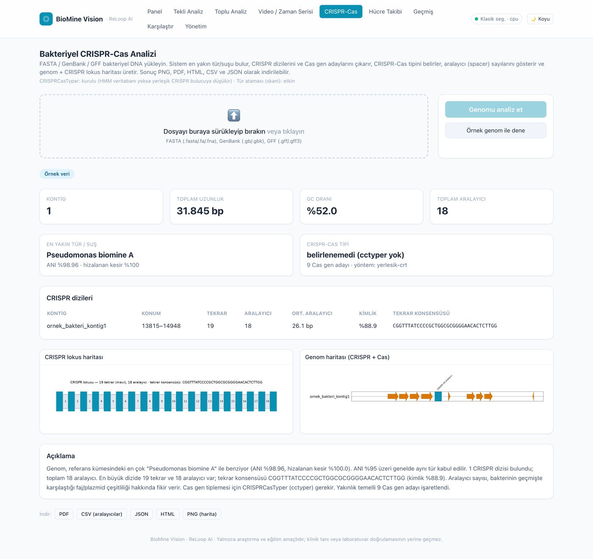
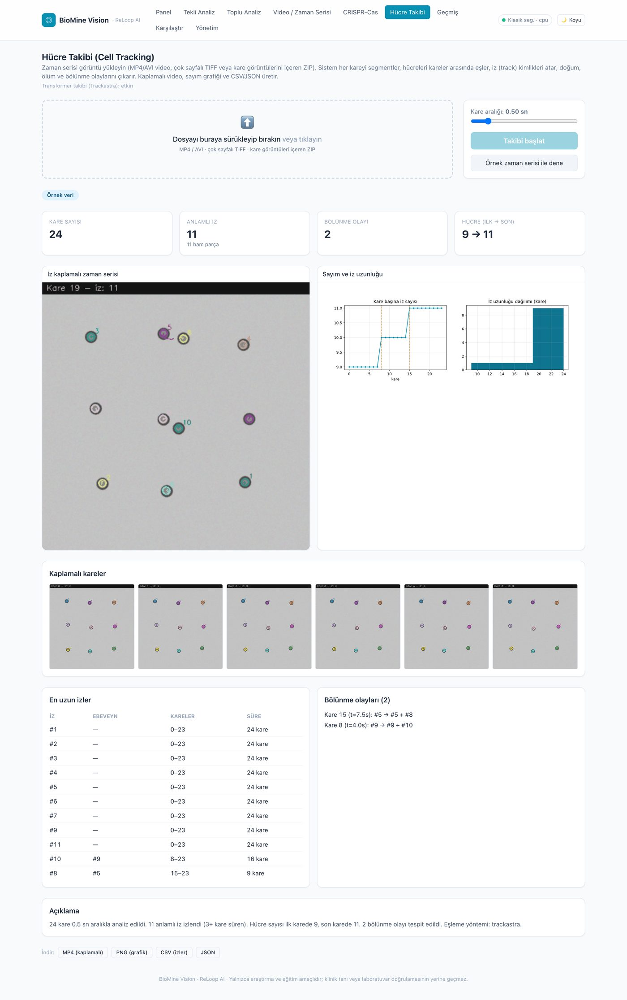

<div align="center">

# 🔬 BioMine Vision

**Biyoliç ve mikrobiyoloji için uçtan uca yapay zekâ analiz platformu**

_ReLoop AI ekibi_

Mikroskop görüntüsü · toplu ZIP · video · **bakteriyel DNA (FASTA/GenBank/GFF)** · **zaman serisi hücre takibi**

Bakteri tespiti · renkli segmentasyon · sayım · morfoloji · sınıf tahmini · Grad-CAM ·
CRISPR-Cas analizi · hücre soyağacı · kural tabanlı Türkçe uyarılar · PDF / CSV / JSON / HTML rapor


</div>

---

> ⚠️ **Sorumluluk reddi:** BioMine Vision bir araştırma ve eğitim aracıdır.
> Sonuçlar yapay zekâ destekli ön analizdir; klinik tanı, laboratuvar
> doğrulaması veya endüstriyel süreç kararlarının yerine geçmez.

---

## İçindekiler

1. [Ne işe yarar?](#ne-i̇şe-yarar)
2. [Özellikler](#özellikler)
3. [Kullanılan yapay zekâ modelleri](#kullanılan-yapay-zekâ-modelleri)
4. [Ekran görüntüleri](#ekran-görüntüleri)
5. [Sistem mimarisi](#sistem-mimarisi)
6. [Klasör yapısı](#klasör-yapısı)
7. [Kurulum](#kurulum)
8. [Docker ile çalıştırma](#docker-i̇le-çalıştırma)
9. [Örnek kullanım](#örnek-kullanım)
10. [Görüntü analizi hattı](#görüntü-analizi-hattı)
11. [CRISPR-Cas analizi](#crispr-cas-analizi)
12. [Hücre takibi](#hücre-takibi)
13. [Kural motoru ve uyarılar](#kural-motoru-ve-uyarılar)
14. [API uç noktaları](#api-uç-noktaları)
15. [MCP ile donanım entegrasyonu (yol haritası)](#mcp-i̇le-donanım-entegrasyonu-yol-haritası)
16. [Testler](#testler)
17. [Bilinen sınırlamalar](#bilinen-sınırlamalar)
18. [Lisanslar ve üçüncü taraf bileşenler](#lisanslar-ve-üçüncü-taraf-bileşenler)
19. [Yol haritası](#yol-haritası)

---

## Ne işe yarar?

Biyoliç (bioleaching) süreçlerinde metal geri kazanımını sürdüren mikroorganizma
kültürleri; mikroskopla, genom dizilemesiyle ve zaman serisi görüntülemeyle
sürekli izlenir. BioMine Vision bu üç veri türünü **tek platformda**, hızlı,
tekrarlanabilir ve **açıklanabilir** biçimde analiz eder.

| Girdi | Ne yapar | Çıktı |
|---|---|---|
| JPG / PNG / TIFF görüntü, toplu **ZIP**, **MP4 / AVI** video | Segmentasyon, sayım, morfoloji, tam görüntü sınıflandırması, Grad-CAM, kural motoru | İşaretli görüntü, ölçümler, ilk 5 tahmin + güven, uyarılar, risk, sade Türkçe açıklama |
| **FASTA / GenBank / GFF** bakteriyel DNA | En yakın tür/suş (ANI), CRISPR dizileri + aralayıcılar, Cas gen adayları, CRISPR-Cas tipi | Genom + CRISPR lokus haritası, aralayıcı tablosu, PNG / PDF / HTML / CSV / JSON |
| **Zaman serisi** (video / TIFF yığını / kare ZIP) | Kare kare segmentasyon, kareler arası eşleme, iz kimlikleri, doğum/ölüm/bölünme | İz kaplamalı video, sayım grafiği, iz tablosu, soyağacı, CSV / JSON |

---

## Özellikler

### Görüntü analizi
- 🖱️ Sürükle-bırak yükleme (tekli / toplu **ZIP** / **MP4-AVI** video)
- 🔧 Gürültü azaltma, LAB uzayında **CLAHE** kontrast iyileştirme
- 📏 Bulanıklık (Laplacian varyansı) ve parlaklık kalite ölçümü
- 🌈 Her bakterinin çevresi farklı renkle çizilir ve numaralandırılır
- 🔢 Hücre sayısı, görüntü kaplama oranı
- 📐 Ortalama hücre alanı, uzunluğu, genişliği, daireselliği
- 🧬 Çubuk / küresel / filamentli morfoloji tahmini ve baskın morfoloji
- 🧠 Tam görüntü sınıflandırması + ilk 5 olasılık + güven yüzdesi
- 🔥 **Grad-CAM** açıklanabilirlik ısı haritası
- 🚫 Yalnızca modelin desteklediği sınıflar; düşük güvende **"Bilinmeyen veya desteklenmeyen bakteri"**
- ⏱️ Video / zaman-sıralı görüntülerde hücre sayısı ve yoğunluk değişimi takibi

### 🧬 Bakteriyel CRISPR-Cas analizi
- En yakın **tür ve suş** (genom benzerliği / ANI)
- **CRISPR dizilerini** ve tekrar/aralayıcı yapılarını çıkarır
- **Cas gen adaylarını** ve mümkünse **CRISPR-Cas tipini** belirler
- **Aralayıcı (spacer) sayılarını** ve tekrar konsensüsünü gösterir
- **Genom haritası** ve ayrıntılı **CRISPR lokus haritası** üretir
- Sonuç: PNG, PDF, HTML, CSV, JSON

### 🎯 Hücre takibi (cell tracking)
- Kare kare segmentasyon + kareler arası hücre eşleme
- Kalıcı **iz (track)** kimlikleri, yörünge çizimi
- **Doğum, ölüm ve bölünme (division)** olayları
- Kare başına hücre sayısı grafiği, iz uzunluğu dağılımı
- İz kaplamalı **video** + kaplamalı kareler
- Sonuç: MP4, PNG, CSV, JSON

### Kural motoru
- 8 kural: düşük güven, bakteri bulunamadı, aşırı yoğunluk, karışık kültür /
  kontaminasyon, ardışık karede aktivite kaybı, bulanık/karanlık görüntü…
- Risk seviyesi: 🟢 Normal / 🟡 Dikkat / 🔴 Kritik
- **Tüm eşik değerleri yönetim ekranından** değiştirilebilir ve kalıcıdır

### Arayüz (tamamı Türkçe)
- Açık / koyu tema, responsive / mobil uyumlu, erişilebilir renkler
- Dashboard, analiz geçmişi, numune karşılaştırma
- Çizgi ve dağılım grafikleri, yükleme ilerleme göstergesi, boş durumlar
- Türkçe hata mesajları (stack trace göstermez)

### Raporlama
- **PDF / CSV / JSON** — tekli ve toplu görüntü analizi
- **PNG / PDF / HTML / CSV / JSON** — CRISPR-Cas analizi
- **MP4 / PNG / CSV / JSON** — hücre takibi

---

## Kullanılan yapay zekâ modelleri

| Görev | Model / yöntem | Nasıl çalışır |
|---|---|---|
| Tam görüntü sınıflandırması | **EfficientNetV2-S** (PyTorch / torchvision omurgası) + numune sınıflarına göre yeniden boyutlandırılmış kafa | Bu depoda dağıtılan **DEMO model**, paketteki sentetik örnek veriyle `scripts/model_egit.py` ile eğitilir (~%95 sentetik doğrulama). 8 morfoloji temelli sınıf. Üretimde kendi etiketli verinizle yeniden eğitin. |
| Açıklanabilirlik | **Grad-CAM** (Gradient-weighted Class Activation Mapping) | Sınıflandırıcının son evrişim bloğunda ileri/geri kanca ile sınıf-ayrımlı ısı haritası üretir. |
| Hücre segmentasyonu | **Omnipose** yerleşik pretrained modeli (`bact_phase_omni`) — opsiyonel | Kuruluysa örnek-bazlı (instance) segmentasyon; değilse Otsu + mesafe dönüşümü + watershed yedeğine otomatik düşülür. Kullanılan yöntem her sonuçta raporlanır. |
| Hücre takibi (kareler arası eşleme) | **Trackastra** — transformer tabanlı hücre takip modeli (opsiyonel) | Kuruluysa `general_2d` pretrained ağırlıkları ile; değilse yerleşik **IoU + Macar algoritması (scipy)** eşleyicisine düşülür. |
| CRISPR-Cas alt tip tahmini | **CRISPRCasTyper** (XGBoost tabanlı tekrar sınıflandırıcı + HMM profilleri) — opsiyonel | Kuruluysa Cas gen operonu ve alt tip; değilse yerleşik **CRT tarzı tekrar/aralayıcı bulucu** çalışır. |
| En yakın tür/suş | **skani** (sketch tabanlı hızlı ANI) — opsiyonel | Paketlenmiş referans genom kümesine karşı ortalama nükleotid kimliği (ANI). |

> Not: Omnipose, Trackastra, CRISPRCasTyper ve skani **opsiyoneldir**. Hiçbiri
> kurulu olmasa bile BioMine Vision tüm akışları yerleşik yöntemlerle çalıştırır.

---

## Ekran görüntüleri

> Tümü gerçek çalışan uygulamadan alınmıştır.

| | |
|---|---|
|  |  |
| Panel | Tekli görüntü analizi — sonuç |
|  |  |
| İşaretlenmiş görüntü + Grad-CAM | Video / zaman serisi |
|  |  |
| Bakteriyel CRISPR-Cas analizi | Hücre takibi |
|  |  |
| Toplu (ZIP) analiz | Yönetim — kural motoru eşikleri |

### Kısa demo


---

## Sistem mimarisi

```
┌──────────────┐   HTTP / JSON    ┌──────────────────────────────────────────┐
│  Frontend    │ ───────────────▶ │  Backend — FastAPI                        │
│  Next.js 14  │ ◀─────────────── │  /api/analiz   /api/genom   /api/takip    │
│  React + TS  │  statik dosya    │  /api/gecmis   /api/karsilastir           │
│  Tailwind    │  /veri/*         │  /api/ayarlar  /api/disari-aktar          │
└──────────────┘                  └───────────────┬──────────────────────────┘
                                                  │
   ┌───────────────┬───────────────┬──────────────┼──────────────┬──────────────┐
   ▼               ▼               ▼              ▼              ▼              ▼
Ön işleme     Segmentasyon    Morfoloji     Sınıflandırma   CRISPR-Cas     Hücre takibi
OpenCV/       gelişmiş +      alan/en/boy   EfficientNetV2  CRT bulucu +   IoU/Macar +
skimage       klasik yedek    şekil,sayım   + Grad-CAM      skani/cctyper  Trackastra
   └───────────────┴───────────────┴──────────────┴──────────────┴──────────────┘
                                   ▼
                  Kural motoru → risk + Türkçe açıklama
                                   ▼
                  SQLite / PostgreSQL  +  PDF / CSV / JSON / HTML
```

Ayrıntı: [`docs/mimari.md`](docs/mimari.md)

**Teknolojiler:** Python 3.11 · FastAPI · SQLAlchemy · PyTorch + torchvision ·
OpenCV · scikit-image · Biopython · pyGenomeViz · matplotlib · ReportLab ·
Next.js 14 · React 18 · TypeScript · Tailwind CSS · Recharts · Docker Compose.

---

## Klasör yapısı

```
reloop-ai-biomine-vision/
├── docker-compose.yml  Makefile  .env.example  LICENSE  NOTICE
├── backend/
│   ├── app/
│   │   ├── main.py  config.py  database.py  models.py  schemas.py
│   │   ├── api/                # analiz / genom / takip / gecmis / karsilastir / ayar / disari-aktar
│   │   ├── core/
│   │   │   ├── on_isleme.py  segmentasyon.py  morfoloji.py  isaretleme.py
│   │   │   ├── grad_cam.py  uyari_motoru.py  video.py  rapor.py  hat.py
│   │   │   ├── genom.py        # CRISPR-Cas: CRT bulucu + skani + cctyper + pyGenomeViz
│   │   │   └── takip.py        # hücre takibi: IoU/Macar + Trackastra
│   │   ├── ml/  siniflar.py  siniflandirici.py
│   │   └── utils/  loglama.py  dosya.py
│   ├── scripts/  kurulum.sh  ornek_veri_uret.py  model_egit.py
│   │             ornek_genom_uret.py  ornek_takip_uret.py  demo.py
│   ├── tests/                  # 36 test (pytest)
│   └── ornek_veri/
│       ├── vitrin/             # hızlı-demo mikroskop görüntüleri
│       ├── genom/              # örnek bakteriyel genom + skani referansları
│       └── takip/              # örnek zaman serisi
├── frontend/
│   ├── app/  panel · analiz · toplu · video · crispr · takip · gecmis · karsilastir · ayarlar
│   ├── components/  lib/  scripts/
├── docs/  mimari.md  demo-senaryosu.md  lisanslar/  ekran-goruntuleri/
└── .github/workflows/ci.yml
```

---

## Kurulum

### Gereksinimler
- **Docker + Docker Compose** (önerilen) **veya** Python **3.11+**, Node **20+**
- İsteğe bağlı: NVIDIA GPU + CUDA (otomatik algılanır; yoksa CPU)
- İsteğe bağlı harici araçlar (CRISPR-Cas için): `skani`, `hmmer`, `prodigal`
  (`brew install skani hmmer prodigal libomp` / `apt install skani hmmer prodigal`)

### Yol A — Docker (önerilen)

```bash
git clone https://github.com/yasinkrc/reloop-ai-biomine-vision.git
cd reloop-ai-biomine-vision
docker compose up --build
```

- Arayüz: <http://localhost:3000>
- API dokümanı (Swagger): <http://localhost:8000/docs>
- Sağlık kontrolü: <http://localhost:8000/api/saglik>

### Yol B — Elle kurulum

```bash
cd backend
bash scripts/kurulum.sh          # venv + bağımlılık + örnek veri/genom/zaman-serisi + DEMO model
source .venv/bin/activate
uvicorn app.main:app --reload    # http://localhost:8000

# ayrı terminal
cd frontend
npm install
npm run dev                      # http://localhost:3000
```

Gelişmiş bileşenler (opsiyonel):
```bash
KUR_SKANI=1 KUR_BIO_ILERI=1 bash scripts/kurulum.sh   # skani/hmmer/prodigal + cctyper + trackastra
```

### Makefile kısayolları

```bash
make kurulum   # backend kurulumu
make backend   # API sunucusu
make frontend  # Next.js dev sunucusu
make test      # backend testleri
make demo      # sunucusuz uçtan uca demo
make docker    # docker compose up --build
```

---

## Docker ile çalıştırma

`docker-compose.yml` üç servis tanımlar:

| Servis | Görev | Port |
|---|---|---|
| `db` | PostgreSQL 16 (opsiyonel; kapalıysa backend SQLite kullanır) | 5432 |
| `backend` | FastAPI + PyTorch; örnek veri & DEMO model imaj içinde üretilir | 8000 |
| `frontend` | Next.js standalone üretim sunucusu, API'yi `backend`e proxy'ler | 3000 |

```bash
docker compose up --build      # ayağa kaldır
docker compose logs -f backend # logları izle
docker compose down            # durdur   (-v ile birlikte volume'leri de sil)
```

---

## Örnek kullanım

### Arayüzden
1. **Tekli Analiz** — görüntü sürükleyin veya _"Örnek verilerle dene"_ düğmelerine tıklayın.
2. **Video / Zaman Serisi** — MP4/AVI yükleyin; hücre sayısı–zaman grafiğini görün.
3. **CRISPR-Cas** — FASTA/GenBank/GFF yükleyin veya _"Örnek genom ile dene"_.
4. **Hücre Takibi** — video/TIFF/ZIP yükleyin veya _"Örnek zaman serisi ile dene"_.
5. **Yönetim** — kural motoru eşiklerini değiştirin (anında etkili).

### Sunucusuz uçtan uca demo
```bash
cd backend && source .venv/bin/activate
python scripts/demo.py
```

### API ile (curl)
```bash
curl http://localhost:8000/api/saglik

# Görüntü
curl -X POST "http://localhost:8000/api/analiz/ornek?ad=filamentli_organizma"
curl -X POST http://localhost:8000/api/analiz/gorsel -F "dosya=@numune.png" -F "gradcam=true"

# CRISPR-Cas
curl -X POST http://localhost:8000/api/genom/ornek
curl -X POST http://localhost:8000/api/genom/analiz -F "dosya=@genom.fasta"

# Hücre takibi
curl -X POST http://localhost:8000/api/takip/ornek
curl -X POST http://localhost:8000/api/takip/analiz -F "dosya=@zaman_serisi.zip" -F "kare_araligi_sn=0.5"
```

---

## Görüntü analizi hattı

`backend/app/core/hat.py` — tek görüntü için:

1. **Ön işleme** — okuma (JPG/PNG/TIFF/16-bit), ölçekleme, non-local means gürültü
   azaltma, LAB-CLAHE kontrast, bulanıklık + parlaklık ölçümü.
2. **Segmentasyon** — gelişmiş (Omnipose) ya da klasik watershed yedeği.
3. **Morfoloji** — her hücre için alan, majör/minör eksen, dairesellik, en/boy;
   çubuk/küresel/filamentli sınıflaması; kaplama oranı, baskın morfoloji.
4. **Sınıflandırma** — EfficientNetV2-S; softmax olasılıkları, ilk 5, güven.
   Güven eşiğin altındaysa "Bilinmeyen veya desteklenmeyen bakteri".
5. **Grad-CAM** — sınıf-ayrımlı ısı haritası, JET renk haritasıyla bindirilir.
6. **İşaretleme** — her hücre kendi renginde çizilir, numaralandırılır.
7. **Kural motoru** — eşiklere göre uyarılar, risk seviyesi, sade Türkçe açıklama.
8. **Kalıcılık** — SQLite/PostgreSQL; görseller `/veri/...` yolundan sunulur.

---

## CRISPR-Cas analizi

`backend/app/core/genom.py` · uç nokta: `POST /api/genom/analiz`

1. **Dizi okuma** — Biopython ile FASTA / GenBank / GFF (gömülü FASTA) ayrıştırma.
2. **CRISPR dizisi bulma** — yerleşik **CRT tarzı** bulucu: kesin tohum eşleşmesi
   + esnek uzatma ile 20–48 bp tekrarlar ve 20–100 bp aralayıcılar; ileri ve ters
   tamamlayıcı şeritte tarama; çakışan bulguların birleştirilmesi. Her dizi için
   tekrar konsensüsü, tekrar/aralayıcı sayısı, kimlik yüzdesi.
3. **Cas gen adayları** — `prodigal` ile ORF çağrısı + CRISPR lokuslarına
   yakınlık (≤ 20 kb). `cctyper` kuruluysa gerçek Cas operonu ve alt tip.
4. **En yakın tür/suş** — `skani` + paketlenmiş referans genom kümesiyle ANI.
   (Üretimde GTDB temsili genomlarıyla çalıştırın.)
5. **Görselleştirme** — `pyGenomeViz` ile genom haritası (CRISPR + Cas), ayrıntılı
   CRISPR lokus şeması (tekrarlar ve numaralı aralayıcılar).
6. **Çıktı** — PNG (harita), PDF (özet + haritalar), HTML (tablo raporu),
   CSV (aralayıcı tablosu), JSON (tam sonuç).

Örnek genom (`backend/ornek_veri/genom/ornek_bakteri.fasta`): sentetik bir kontig
+ gömülü kanonik CRISPR dizisi (28 bp tekrar, ~18 aralayıcı) + Cas benzeri ORF'ler.
Ekranda **"Örnek veri"** etiketiyle sunulur.

---

## Hücre takibi

`backend/app/core/takip.py` · uç nokta: `POST /api/takip/analiz`

1. **Kare çıkarma** — MP4/AVI (belirli sn aralıkla), çok sayfalı TIFF veya kare
   görüntülerini içeren ZIP (sıralı).
2. **Segmentasyon** — her kare mevcut segmentasyon modülüyle işlenir.
3. **Eşleme** — `trackastra` kuruluysa transformer modeli; değilse yerleşik
   **IoU + merkez uzaklığı + alan tutarlılığı** maliyetiyle Macar algoritması
   (scipy). Kalıcı iz kimlikleri, doğum/ölüm.
4. **Bölünme çıkarımı** — 0. kareden sonra doğan bir iz, doğum anında başka bir
   izin son konumuna ~28 px yakınsa ebeveyn-çocuk bağı kurulur.
5. **Görselleştirme** — iz kimlikleri + yörüngeler kaplamalı kareler ve MP4;
   kare başına iz sayısı grafiği, iz uzunluğu histogramı.
6. **Çıktı** — MP4 (kaplamalı), PNG (grafik), CSV (izler: id, ebeveyn, kare, x, y,
   alan), JSON (tam soyağacı).

Örnek zaman serisi (`backend/ornek_veri/takip/`): 24 kare, ızgara düzeninde 9
hücre, rastgele yürüyüş + 8. ve 15. karede birer bölünme.

---

## Kural motoru ve uyarılar

| Kod | Koşul (eşik anahtarı) | Seviye |
|---|---|---|
| `goruntu_kalitesi` | Laplacian < `bulaniklik_esik` veya parlaklık < `karanlik_esik` | 🔴 kritik |
| `yetersiz_numune` | hücre sayısı < `min_hucre_sayisi` | 🔴 kritik |
| `dusuk_guven` | güven < `guven_uyari` | 🟡 dikkat |
| `desteklenmeyen_sinif` | güven < `guven_dusuk` veya model eğitilmedi | 🟡 dikkat |
| `asiri_yogunluk` | kaplama > `asiri_yogunluk_kaplama` veya yoğunluk > `asiri_yogunluk_mp` | 🟡 dikkat |
| `karisik_kultur` | baskın morfoloji oranı < `baskin_morfoloji_orani` | 🟡 dikkat |
| `aktivite_kaybi` / `seri_aktivite_kaybi` | ardışık karede / seri boyunca düşüş > eşik | 🔴 kritik |

Tüm eşikler **Yönetim** ekranından (`PUT /api/ayarlar/{anahtar}`) değiştirilebilir
ve `ayar` tablosunda kalıcıdır.

---

## API uç noktaları

| Yöntem | Yol | Açıklama |
|---|---|---|
| `GET` | `/api/saglik` | sürüm, cihaz, segmentasyon yöntemi |
| `POST` | `/api/analiz/gorsel` \| `/toplu` \| `/video` \| `/ornek` | görüntü / ZIP / video / örnek |
| `POST` | `/api/genom/analiz` \| `/ornek` · `GET /api/genom/durum` | CRISPR-Cas analizi |
| `POST` | `/api/takip/analiz` \| `/ornek` · `GET /api/takip/durum` | hücre takibi |
| `GET` `DELETE` | `/api/gecmis` , `/api/gecmis/{id}` | analiz geçmişi |
| `POST` | `/api/karsilastir` | iki analizi karşılaştır |
| `GET` `PUT` | `/api/ayarlar` , `/api/ayarlar/{anahtar}` | eşikler |
| `POST` | `/api/disari-aktar` | `{analiz_idleri, bicim: pdf\|csv\|json}` |

Etkileşimli dokümantasyon: `http://localhost:8000/docs`

---

## MCP ile donanım entegrasyonu (yol haritası)

**MCP (Model Context Protocol — Model Bağlam Protokolü)**, yapay zekâ modellerinin
(LLM) harici veri kaynakları, araçlar ve yazılımlarla **güvenli ve standart** bir
biçimde iletişim kurmasını sağlayan açık kaynaklı bir protokoldür.

BioMine Vision'ın hedefi, analiz motorunu bir **MCP sunucusu** olarak da
yayımlamaktır. Böylece:

- **Mikroskoplar, kameralar ve laboratuvar cihazları** BioMine Vision'a birer
  MCP eklentisi olarak bağlanabilir; görüntü/dizileme verisi cihazdan doğrudan
  analiz hattına akar.
- **Otomasyon ve robotik sistemler** (sıvı taşıma robotları, biyoreaktör
  kontrolörleri) analiz sonuçlarını standart bir arabirimden okuyup süreç
  kararlarını besleyebilir.
- Üçüncü taraf yapay zekâ ajanları, tespit/segmentasyon/CRISPR-Cas araçlarını
  yeniden yazmadan, MCP üzerinden çağırabilir.
- Tüm cihaz erişimi tek bir güvenli, izin tabanlı protokol katmanında toplanır.

Bu, "her donanım ürününe — mikroskoplar, makineler — eklenti özelliği" vizyonunun
teknik temelidir. (Bkz. [Yol haritası](#yol-haritası).)

---

## Testler

```bash
cd backend && source .venv/bin/activate
python -m pytest -q          # 36 test: ön işleme, segmentasyon, morfoloji,
                             # kural motoru, sınıflandırıcı, Grad-CAM, API,
                             # CRISPR-Cas (CRT bulucu, uçtan uca), hücre takibi
```

GitHub Actions (`.github/workflows/ci.yml`) her push'ta backend testlerini ve
frontend derlemesini çalıştırır.

**Bu depoda uçtan uca doğrulanan akışlar:** tekli/toplu/video analizi · düşük
güvende "bilinmeyen" sonucu · kural motorunun tüm koşulları · PDF/CSV/JSON dışa
aktarma · CRISPR-Cas (gömülü CRISPR dizili örnek genom → aralayıcı sayımı, tür
ataması, genom + lokus haritası, tüm rapor biçimleri) · hücre takibi (24 kare →
izler, bölünme tespiti, kaplamalı video, CSV/JSON) · açık/koyu tema · mobil.

---

## Bilinen sınırlamalar

- **DEMO sınıflandırıcı sentetik veriyle eğitilir.** Gerçek biyoliç numuneleri için
  kendi etiketli veri kümenizle yeniden eğitin. Model eğitilmemişse arayüz bunu
  açıkça belirtir.
- **Omnipose kurulu değilse** morfoloji ölçümleri klasik watershed'e dayanır;
  yoğun, birbirine değen çubuk hücrelerde bu yöntem parçalanmaya eğilimlidir.
- **skani referans kümesi** bu depoda küçük ve sentetiktir (demo). Üretim tür
  ataması için GTDB temsili genomlarıyla çalıştırın.
- **CRISPRCasTyper alt tiplemesi** HMM veritabanı gerektirir; veritabanı yoksa
  sistem yerleşik CRISPR bulucuya düşer ve Cas tipini "belirlenemedi" bildirir.
- **Bölünme tespiti** segmentasyon kalitesine bağlıdır; gürültülü maskelerde
  yanlış pozitif/negatif olabilir.
- Kimlik doğrulama / çok kullanıcılı yetkilendirme kapsam dışıdır.
- Sistem **CRISPR/genom düzenleme uygulamaz** — yalnızca mevcut CRISPR-Cas
  yapılarını **analiz eder**. IoT/sensör/donanım kontrolü bu sürümde yoktur
  (bkz. MCP yol haritası).

---

## Lisanslar ve üçüncü taraf bileşenler

- **BioMine Vision:** [MIT](LICENSE)
- Kullanılan tüm açık kaynak bileşenler, sürümleri ve lisansları
  [`NOTICE`](NOTICE) dosyasında; ilgili tam lisans metinleri
  [`docs/lisanslar/`](docs/lisanslar/) dizininde listelenmiştir.
- Opsiyonel bileşenler (Omnipose, Trackastra, CRISPRCasTyper, skani, pyGenomeViz)
  kütüphane/CLI olarak kullanılır; kaynak kodları bu depoya kopyalanmamıştır.
- Tam görüntü sınıflandırma + Grad-CAM iş akışı PyTorch/torchvision ile sıfırdan
  yazılmıştır.

---

## Yol haritası

- [ ] MCP sunucusu: mikroskop / cihaz / robotik eklentileri, izin tabanlı erişim
- [ ] Gerçek etiketli biyoliç veri kümesiyle eğitilmiş sınıflandırıcı
- [ ] GTDB temsili genomlarıyla üretim düzeyi tür/suş ataması
- [ ] CRISPRCasTyper HMM veritabanının kurulum betiğiyle otomatik indirilmesi
- [ ] Aralayıcı → faj/plazmid eşleştirmesi (spacer BLAST)
- [ ] Ölçek kalibrasyonu (µm/piksel) ile mikrometre cinsinden ölçüm
- [ ] Hücre takibinde büyüme eğrisi ve bölünme oranı kestirimi
- [ ] Toplu işler için arka plan kuyruğu ve ilerleme yüzdesi
- [ ] Kullanıcı hesapları, proje/numune bazlı erişim
- [ ] ONNX / TensorRT ile hızlandırılmış çıkarım

---

<div align="center">
<sub>BioMine Vision · ReLoop AI · 2026 — MIT Lisansı · Araştırma ve eğitim amaçlıdır.</sub>
</div>
