<div align="center">

# 🔬 BioMine Vision

**Biyoliç ve mikrobiyoloji mikroskop görüntülerini yapay zeka ile inceleyen uçtan uca web uygulaması**

_ReLoop AI ekibi_

Bakteri tespiti · renkli işaretleme · sayım · morfoloji ölçümü · sınıf tahmini · güven oranı · Grad-CAM · kural tabanlı Türkçe uyarılar · PDF/CSV/JSON rapor

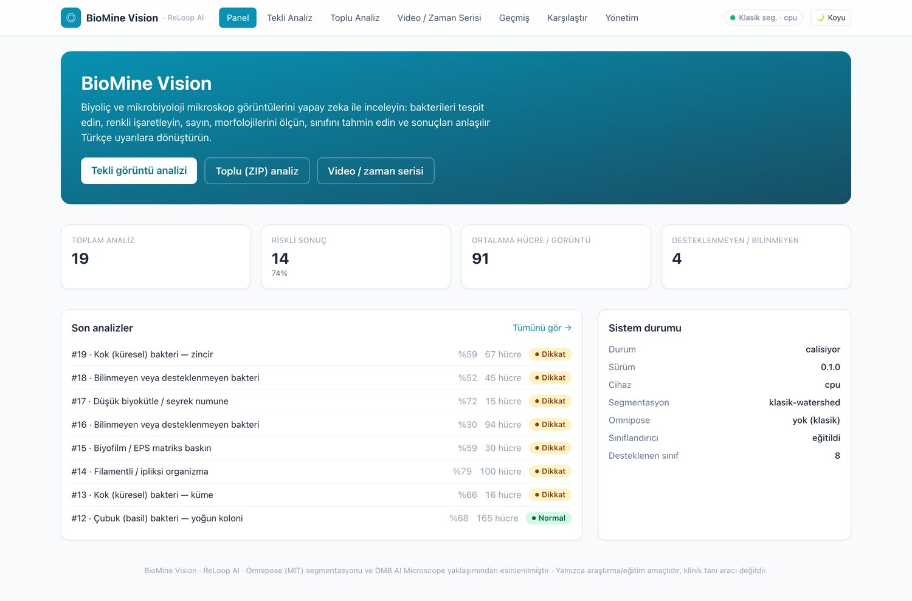

</div>

---

## İçindekiler

1. [ReLoop AI ekibi](#reloop-ai-ekibi)
2. [Projenin amacı ve çözdüğü problem](#projenin-amacı-ve-çözdüğü-problem)
3. [Özellikler](#özellikler)
4. [Kullanılan iki açık kaynak repo](#kullanılan-iki-açık-kaynak-repo)
5. [Sistem mimarisi](#sistem-mimarisi)
6. [Klasör yapısı](#klasör-yapısı)
7. [Kurulum adımları](#kurulum-adımları)
8. [Docker ile çalıştırma](#docker-ile-çalıştırma)
9. [Örnek kullanım](#örnek-kullanım)
10. [Ekran görüntüleri](#ekran-görüntüleri)
11. [Model ve veri seti bilgileri](#model-ve-veri-seti-bilgileri)
12. [Kural motoru ve uyarılar](#kural-motoru-ve-uyarılar)
13. [API uç noktaları](#api-uç-noktaları)
14. [Testler](#testler)
15. [Bilinen sınırlamalar](#bilinen-sınırlamalar)
16. [Lisanslar](#lisanslar)
17. [Gelecek geliştirmeler](#gelecek-geliştirmeler)

---

## ReLoop AI ekibi

**BioMine Vision**, ReLoop AI ekibi tarafından biyomadencilik (biyoliç / _bioleaching_)
ve mikrobiyoloji laboratuvarlarında üretilen çok sayıda mikroskop görüntüsünü hızlı,
tekrarlanabilir ve açıklanabilir biçimde analiz etmek amacıyla geliştirilmiştir.

Proje; hazır iki güçlü açık kaynak çalışmayı (Omnipose + AI Microscope yaklaşımı)
temiz, modüler ve tamamen Türkçe bir mimaride birleştirir. Kod, yarışma jürisinin
depoyu indirip **birkaç komutla** çalıştırabileceği şekilde hazırlanmıştır.

> ⚠️ **Sorumluluk reddi:** BioMine Vision bir araştırma / eğitim aracıdır; klinik tanı
> veya endüstriyel süreç kararları için tek başına kullanılmamalıdır.

---

## Projenin amacı ve çözdüğü problem

Biyoliç süreçlerinde metal geri kazanımını sürdüren mikroorganizma kültürleri
düzenli olarak mikroskopla izlenir. Uygulamada karşılaşılan sorunlar:

| Problem | BioMine Vision'ın yaklaşımı |
|---|---|
| Yüzlerce görüntünün elle sayımı yavaş ve öznel | Otomatik segmentasyon + sayım + morfoloji ölçümü |
| Hücrelerin birbirine değdiği yoğun alanlarda ayrım zor | **Omnipose** ile örnek-bazlı (instance) segmentasyon |
| "Model ne gördü?" sorusu yanıtsız kalıyor | **Grad-CAM** ısı haritası ile açıklanabilirlik |
| Sonuçların yorumu uzmana bağlı | Kural tabanlı **Türkçe uyarı motoru** + risk seviyesi |
| Zaman içindeki değişim (aktivite kaybı) gözden kaçıyor | Video / zaman-sıralı görüntü serisi takibi |
| Raporlama dağınık | Tek tıkla **PDF / CSV / JSON** rapor |
| Desteklenmeyen bakteride "uydurma" tahmin riski | Düşük güvende **"Bilinmeyen veya desteklenmeyen bakteri"** |

**Girdi:** JPG, PNG, TIFF görüntüler · toplu **ZIP** · **MP4 / AVI** video
**Çıktı:** işaretlenmiş görüntü, hücre sayısı, kaplama oranı, morfoloji ölçümleri,
tahmin edilen sınıf + ilk 5 olasılık + güven yüzdesi, Grad-CAM, uyarılar, risk
seviyesi ve sade Türkçe açıklama.

---

## Özellikler

### Yükleme ve girdi
- 🖱️ **Sürükle-bırak** dosya yükleme
- 🖼️ Tekli görüntü analizi (JPG / PNG / TIFF / 16-bit dâhil)
- 🗜️ Toplu analiz — **ZIP** içindeki tüm görüntüler
- 🎞️ **Video** (MP4 / AVI) karelerini belirlenen saniye aralığıyla analiz
- ⏱️ Zaman-sıralı görüntülerde **hücre sayısı ve yoğunluk değişimi** takibi
- 🧪 Paketle gelen **örnek analiz verileri** ile tek tıkla demo

### Görüntü işleme
- 🔧 Gürültü azaltma (non-local means)
- 🌗 Kontrast iyileştirme (LAB uzayında **CLAHE**)
- 📏 Bulanıklık (Laplacian varyansı) ve parlaklık kalite ölçümü

### Segmentasyon ve morfoloji (Omnipose)
- 🌈 Her bakterinin çevresi **farklı renkle** çizilir ve numaralandırılır
- 🔢 Toplam hücre sayısı, görüntü **kaplama oranı**
- 📐 Ortalama hücre **alanı, uzunluğu, genişliği, daireselliği**
- 🧬 **Çubuk / küresel / filamentli** morfoloji tahmini ve baskın morfoloji

### Sınıflandırma ve açıklanabilirlik
- 🧠 Tam görüntü sınıflandırması (**EfficientNetV2** omurgası, PyTorch)
- 🏷️ Tahmin edilen sınıf + **ilk 5 olası sonuç** + güven yüzdeleri
- 🔥 **Grad-CAM** ısı haritası
- 🚫 Yalnızca modelin gerçekten desteklediği sınıflar gösterilir; düşük güvende
  **"Bilinmeyen veya desteklenmeyen bakteri"**

### Kural motoru
- ⚠️ 8 farklı kural: düşük güven, bakteri bulunamadı, aşırı yoğunluk, karışık
  kültür / kontaminasyon, ardışık karede aktivite kaybı, bulanık/karanlık görüntü…
- 🟢🟡🔴 Risk seviyesi: **Normal / Dikkat / Kritik**
- 🎛️ **Tüm eşik değerleri yönetim ekranından** değiştirilebilir ve kalıcıdır

### Arayüz (tamamı Türkçe)
- 🌓 Açık / koyu tema
- 📊 Şık dashboard, analiz geçmişi, **numune karşılaştırma** ekranı
- 📈 Çizgi grafiği (zaman serisi) ve dağılım grafiği (hücre boyutları)
- ⏳ Yükleme ilerleme göstergesi, boş durumlar, hata mesajları
- ♿ Erişilebilir renkler ve odak halkaları, responsive / mobil uyumlu

### Raporlama
- 📄 **PDF** (görsel rapor), **CSV**, **JSON** dışa aktarma — tekli ve toplu

---

## Kullanılan iki açık kaynak repo

| Repo | Rol | Lisans | Bu projede |
|---|---|---|---|
| [kevinjohncutler/**omnipose**](https://github.com/kevinjohncutler/omnipose) | Bakteri segmentasyonu, hücrelerin ayrılması, yerleşik pretrained modeller (`bact_phase_omni`, `bact_fluor_omni`) | **MIT** | `omnipose` PyPI paketi bağımlılık olarak kullanılır; MIT bildirimi [`NOTICE`](NOTICE) ve [`docs/lisanslar/`](docs/lisanslar/) altında korunur |
| [DMB13/**AI_MICROSCOPE**](https://github.com/DMB13/AI_MICROSCOPE-main) | Tam görüntü sınıflandırma + güven skoru + **Grad-CAM** açıklanabilir yapay zeka **yaklaşımı** | Açık lisans **yok** | Lisans bulunmadığından **kod kopyalanmamıştır**; EfficientNetV2 + Grad-CAM iş akışı PyTorch/torchvision ile **sıfırdan yeniden yazılmıştır** (`app/ml/siniflandirici.py`, `app/core/grad_cam.py`) ve kaynak olarak gösterilmiştir |

> DMB AI Microscope deposu TensorFlow/Keras + masaüstü (Tkinter) tabanlıdır ve
> 34 **klinik** Gram-boyama türü için eğitilmiş bir `.keras` modeli içerir. BioMine
> Vision web + PyTorch mimarisine geçtiği ve o deponun ağırlıkları lisanssız olduğu
> için **o ağırlık dosyası bu depoya dâhil edilmemiştir**; bunun yerine kendi DEMO
> modelimiz paketteki örnek veriyle eğitilir (bkz. [Model ve veri seti](#model-ve-veri-seti-bilgileri)).

---

## Sistem mimarisi

```
┌──────────────┐   HTTP / JSON    ┌────────────────────────────────┐
│  Frontend    │ ───────────────▶ │  Backend — FastAPI             │
│  Next.js 14  │ ◀─────────────── │  /api/analiz  /api/gecmis      │
│  React + TS  │  statik görsel   │  /api/karsilastir  /api/ayarlar│
│  Tailwind    │  /veri/*         │  /api/disari-aktar             │
└──────────────┘                  └───────────────┬────────────────┘
                                                  │  app/core/hat.py
        ┌───────────┬───────────────┬─────────────┼───────────────┐
        ▼           ▼               ▼             ▼               ▼
   Ön işleme   Segmentasyon    Morfoloji   Sınıflandırma      Kural
   OpenCV /    Omnipose (MIT)  alan/en/boy EfficientNetV2     motoru
   skimage     └ fallback:     şekil,sayım + Grad-CAM         uyarı + risk
   CLAHE         watershed                  (PyTorch)         (eşikler DB'de)
        └───────────┴───────────────┴─────────────┴───────────────┘
                                 ▼
                   SQLite / PostgreSQL  +  PDF / CSV / JSON
```

Ayrıntı: [`docs/mimari.md`](docs/mimari.md)

**Teknolojiler:** Python 3.11 · FastAPI · SQLAlchemy · PyTorch 2.5 + torchvision ·
Omnipose · OpenCV · scikit-image · ReportLab · Next.js 14 · React 18 · TypeScript ·
Tailwind CSS · Recharts · Docker Compose.

---

## Klasör yapısı

```
reloop-ai-biomine-vision/
├── docker-compose.yml         # tek komutla tüm sistem
├── Makefile                   # kısayollar (make kurulum / test / demo / docker)
├── .env.example               # örnek ortam değişkenleri
├── LICENSE  NOTICE            # MIT + üçüncü taraf atıflar
│
├── backend/
│   ├── app/
│   │   ├── main.py             # FastAPI girişi, /api/saglik
│   │   ├── config.py           # ayarlar + tüm eşik değerleri
│   │   ├── database.py  models.py  schemas.py
│   │   ├── api/                # analiz / geçmiş / karşılaştır / ayarlar / dışa-aktar yolları
│   │   ├── core/
│   │   │   ├── on_isleme.py    # gürültü, CLAHE, kalite ölçümü
│   │   │   ├── segmentasyon.py # Omnipose (+ watershed fallback)
│   │   │   ├── morfoloji.py    # alan/uzunluk/genişlik/şekil, sayım
│   │   │   ├── siniflandirma…  # -> app/ml/siniflandirici.py
│   │   │   ├── grad_cam.py     # Grad-CAM
│   │   │   ├── isaretleme.py   # renkli kontur çizimi, ısı haritası bindirme
│   │   │   ├── uyari_motoru.py # kural motoru + risk + Türkçe açıklama
│   │   │   ├── video.py        # kare çıkarımı
│   │   │   ├── rapor.py        # PDF / CSV / JSON
│   │   │   └── hat.py          # uçtan uca analiz hattı
│   │   ├── ml/
│   │   │   ├── siniflar.py         # desteklenen sınıf listesi (şeffaflık notu)
│   │   │   └── siniflandirici.py   # EfficientNetV2 + tahmin
│   │   └── utils/              # loglama, dosya/ZIP yardımcıları
│   ├── scripts/
│   │   ├── kurulum.sh          # venv + bağımlılık + örnek veri + DEMO model
│   │   ├── ornek_veri_uret.py  # sentetik örnek veri kümesi
│   │   ├── model_egit.py       # DEMO sınıflandırıcı eğitimi
│   │   ├── model_indir.py      # modelleri güvenli hazırlama (https + SHA256)
│   │   ├── demo.py             # sunucusuz uçtan uca demo senaryosu
│   │   └── gif_birlestir.py
│   ├── tests/                  # birim + API testleri (pytest)
│   └── ornek_veri/vitrin/      # depoda tutulan 8 hızlı-demo görüntüsü
│
├── frontend/
│   ├── app/                    # panel, analiz, toplu, video, geçmiş, karşılaştır, ayarlar
│   ├── components/             # DosyaYukle, SonucGorunumu, Grafikler, UstBar, ...
│   ├── lib/                    # api.ts, tipler.ts
│   └── scripts/                # Playwright ekran görüntüsü / GIF betikleri
│
├── docs/
│   ├── mimari.md  demo-senaryosu.md
│   ├── lisanslar/             # OMNIPOSE-LICENSE.txt, CELLPOSE-LICENSE.txt
│   └── ekran-goruntuleri/     # README görselleri + demo.gif
└── .github/workflows/ci.yml   # backend testleri + frontend derleme
```

---

## Kurulum adımları

### Gereksinimler
- **Docker + Docker Compose** (önerilen yol) **veya**
- Python **3.11+**, Node **20+** (elle kurulum)
- İsteğe bağlı: NVIDIA GPU + CUDA (otomatik algılanır; yoksa CPU kullanılır)

### Yol A — Docker (önerilen)

```bash
git clone https://github.com/yasinkrc/reloop-ai-biomine-vision.git
cd reloop-ai-biomine-vision
docker compose up --build
```

- Arayüz: <http://localhost:3000>
- API dokümanı (Swagger): <http://localhost:8000/docs>
- Sağlık kontrolü: <http://localhost:8000/api/saglik>

İlk derlemede backend imajı örnek veriyi üretip **DEMO modeli** eğitir; bu birkaç
dakika sürebilir. `docker compose up` çıktısında `backend` servisi `healthy`
olduğunda sistem hazırdır.

### Yol B — Elle kurulum

**Backend**
```bash
cd backend
bash scripts/kurulum.sh        # venv + bağımlılıklar + örnek veri + DEMO model + veritabanı + demo testi
source .venv/bin/activate
uvicorn app.main:app --reload   # http://localhost:8000
```
Omnipose'u da kurmak için: `KUR_OMNIPOSE=1 bash scripts/kurulum.sh`
(kurulamazsa sistem otomatik olarak klasik watershed segmentasyonuna düşer).

**Frontend**
```bash
cd frontend
npm install
npm run dev                     # http://localhost:3000
```

**Makefile kısayolları**
```bash
make kurulum   # backend kurulumu
make backend   # API sunucusu
make frontend  # Next.js dev sunucusu
make test      # backend testleri
make demo      # sunucusuz uçtan uca demo
make model     # örnek veri + DEMO model eğitimi
make docker    # docker compose up --build
```

### Ortam değişkenleri
[`.env.example`](.env.example) dosyasını `.env` olarak kopyalayın. Öne çıkanlar:
`DATABASE_URL` (SQLite ↔ PostgreSQL), `CIHAZ` (`otomatik|cpu|cuda`),
`OMNIPOSE_MODEL`, `MAKS_DOSYA_MB`, `VIDEO_KARE_ARALIGI` ve `ESIK_*` eşikleri.

---

## Docker ile çalıştırma

`docker-compose.yml` üç servis tanımlar:

| Servis | Görev | Port |
|---|---|---|
| `db` | PostgreSQL 16 (opsiyonel; kapalıysa backend SQLite kullanır) | 5432 |
| `backend` | FastAPI + PyTorch + Omnipose; örnek veri & DEMO model imaj içinde üretilir | 8000 |
| `frontend` | Next.js standalone üretim sunucusu, API'yi `backend`e proxy'ler | 3000 |

```bash
docker compose up --build      # ayağa kaldır
docker compose logs -f backend # logları izle
docker compose down            # durdur   (-v ile birlikte volume'leri de sil)
```

CUDA'lı imaj için `backend/Dockerfile` içindeki PyTorch satırını `cu121` indeksine
çevirin ve `nvidia/cuda` tabanlı bir taban imaj kullanın (dosyada not olarak var).

---

## Örnek kullanım

### Arayüzden
1. **Tekli Analiz** sayfasında bir görüntü sürükleyip bırakın veya alttaki
   _"Örnek verilerle dene"_ düğmelerinden birine tıklayın.
2. Sonuç ekranında orijinal görüntü, işaretlenmiş analiz, Grad-CAM, tahmin edilen
   sınıf + güven, ilk 5 olasılık, morfoloji ölçümleri, uyarılar, risk seviyesi ve
   sade Türkçe açıklama birlikte görüntülenir.
3. **PDF / CSV / JSON** düğmeleriyle raporu indirin.
4. **Video / Zaman Serisi** sayfasında MP4/AVI yükleyip kare aralığını seçin;
   hücre sayısı–zaman grafiğini ve seri uyarılarını görün.
5. **Yönetim** sayfasından kural motoru eşiklerini değiştirin (anında etkili).

### Sunucusuz uçtan uca demo
```bash
cd backend && source .venv/bin/activate
python scripts/demo.py
```
Bu betik: örnek veri üretir → tekli analiz → ZIP toplu analiz → sentetik video ile
zaman serisi (aktivite kaybı senaryosu) → PDF/CSV/JSON rapor üretir ve özet yazar.

### API ile (curl)
```bash
# Sağlık
curl http://localhost:8000/api/saglik

# Örnek görüntüyü analiz et
curl -X POST "http://localhost:8000/api/analiz/ornek?ad=filamentli_organizma"

# Kendi görüntünü yükle
curl -X POST http://localhost:8000/api/analiz/gorsel \
  -F "dosya=@numune.png" -F "gradcam=true"

# Toplu (ZIP)
curl -X POST http://localhost:8000/api/analiz/toplu -F "dosya=@parti.zip"

# Raporu dışa aktar
curl -X POST http://localhost:8000/api/disari-aktar \
  -H "content-type: application/json" \
  -d '{"analiz_idleri":[1,2],"bicim":"pdf"}' -o rapor.pdf
```

---

## Ekran görüntüleri

> Tümü gerçek çalışan uygulamadan alınmıştır (`frontend/scripts/ekran-goruntusu.mjs`).

### Kısa demo
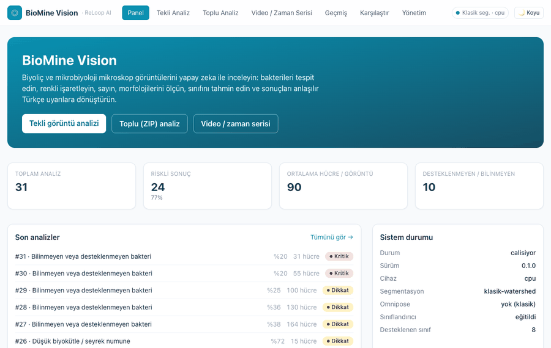

### Panel (dashboard)


### Tekli görüntü analizi — sonuç ekranı
Orijinal görüntü · işaretlenmiş analiz · Grad-CAM · tahmin + güven · ilk 5 olasılık ·
morfoloji ölçümleri · uyarılar · Türkçe açıklama · hücre boyut dağılımı grafiği.

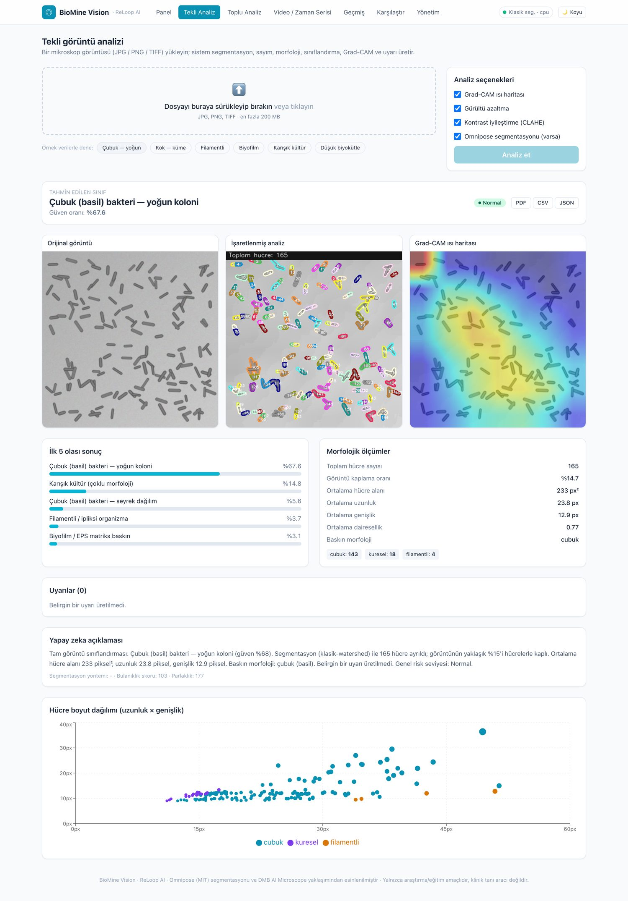

### İşaretlenmiş bakteri görüntüsü + Grad-CAM (yakın plan)
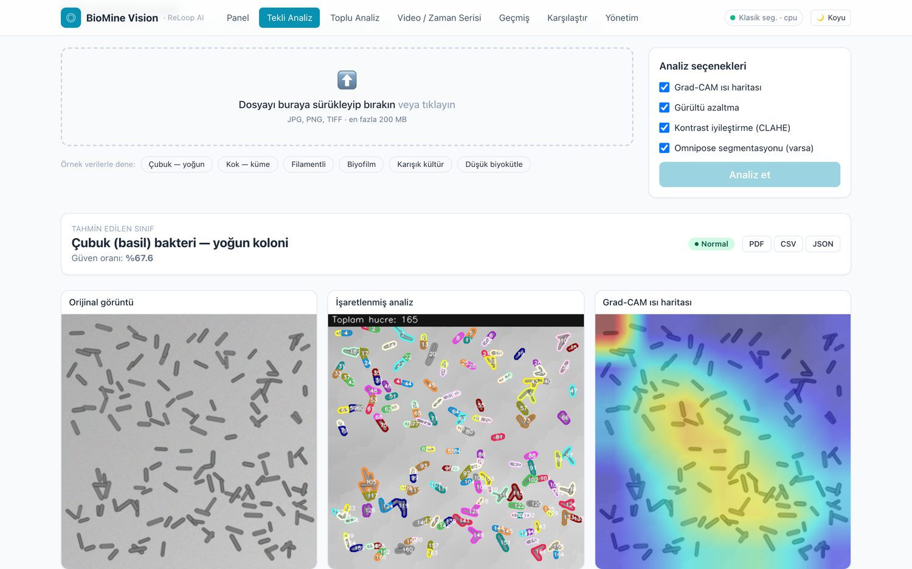

### Toplu (ZIP) analiz
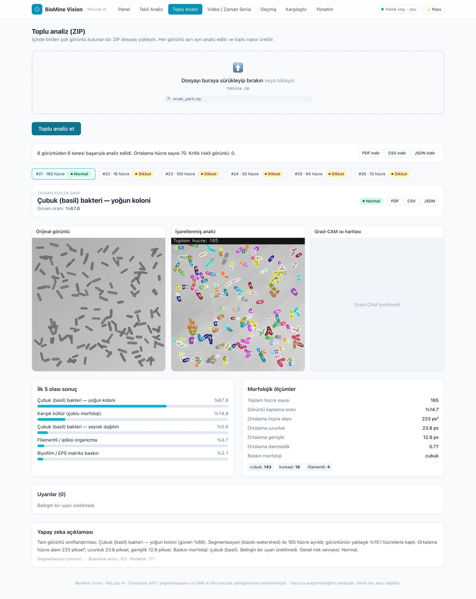

### Video / zaman serisi — hücre sayısı ve yoğunluk değişimi
Çizgi grafiği + "bakteriyel aktivite kaybı" seri uyarısı + kare kare sonuçlar.

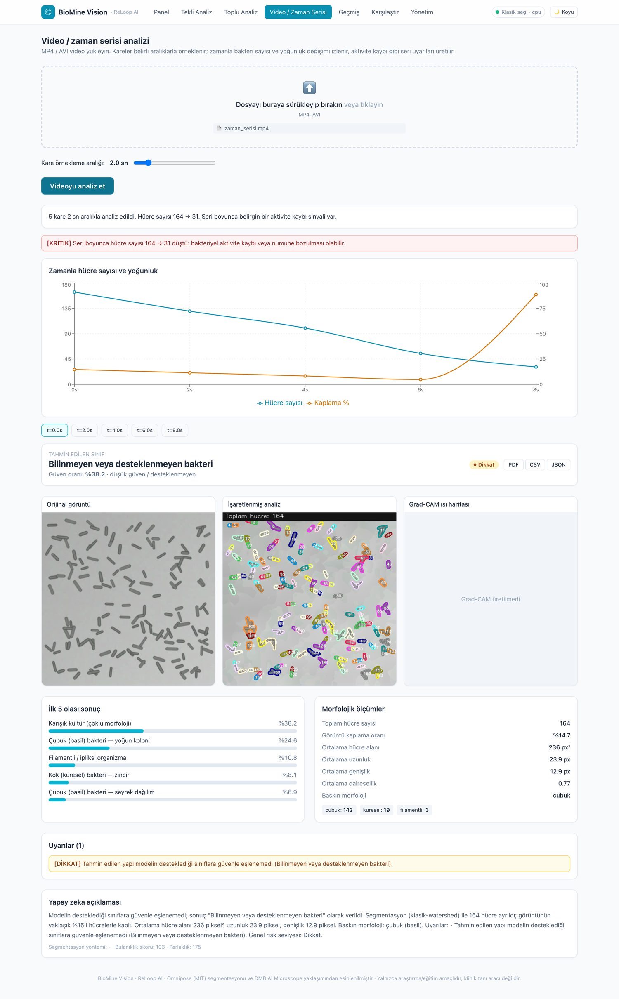

### Analiz geçmişi
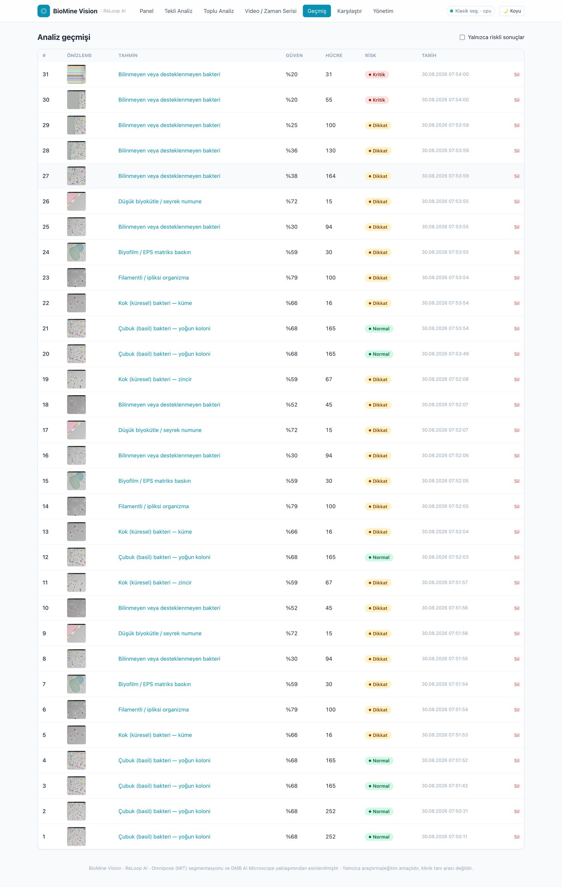

### Analiz detayı (geçmişten)
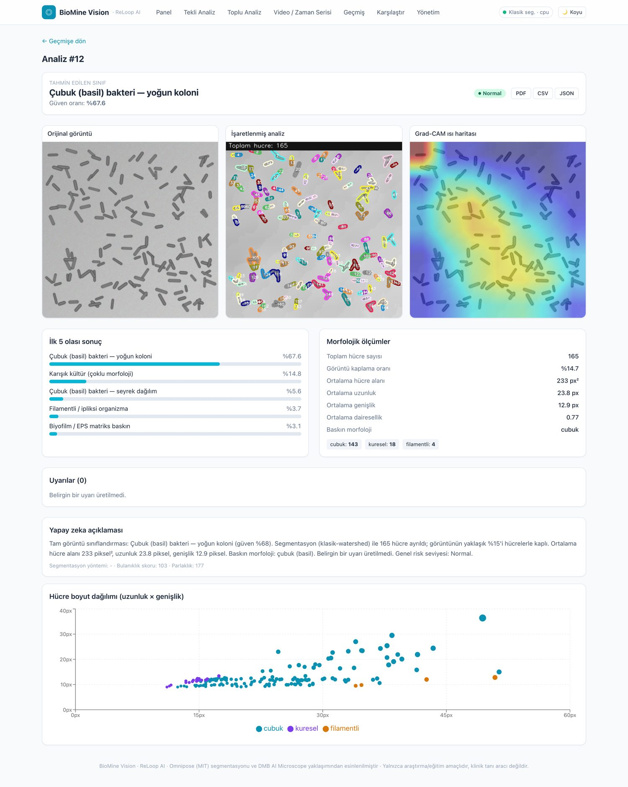

### Numune karşılaştırma
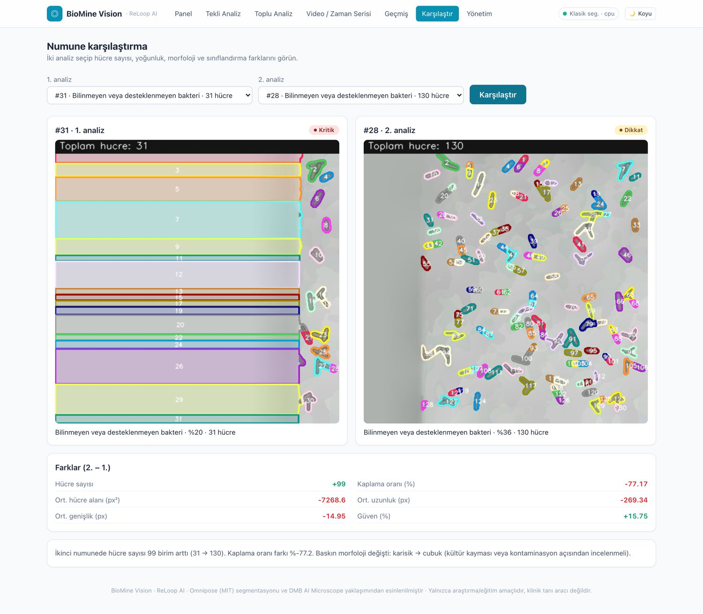

### Yönetim — kural motoru eşikleri
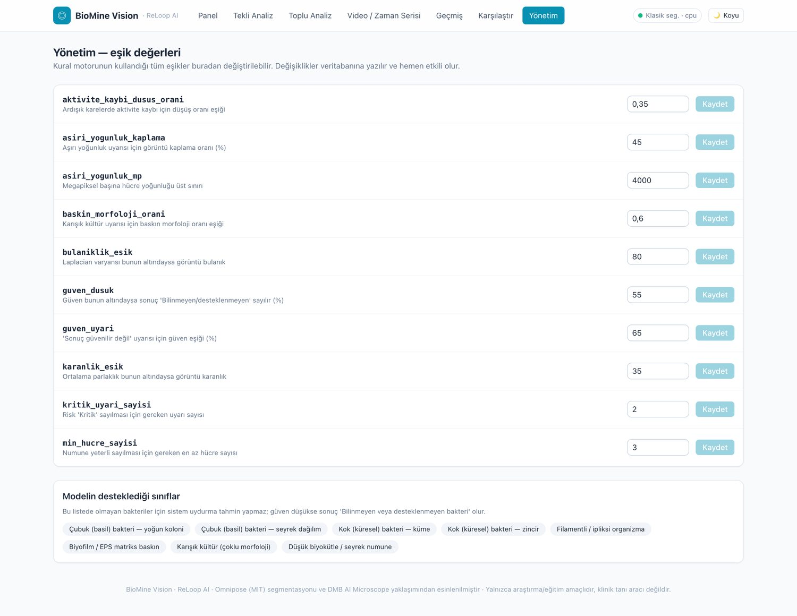

### Koyu tema
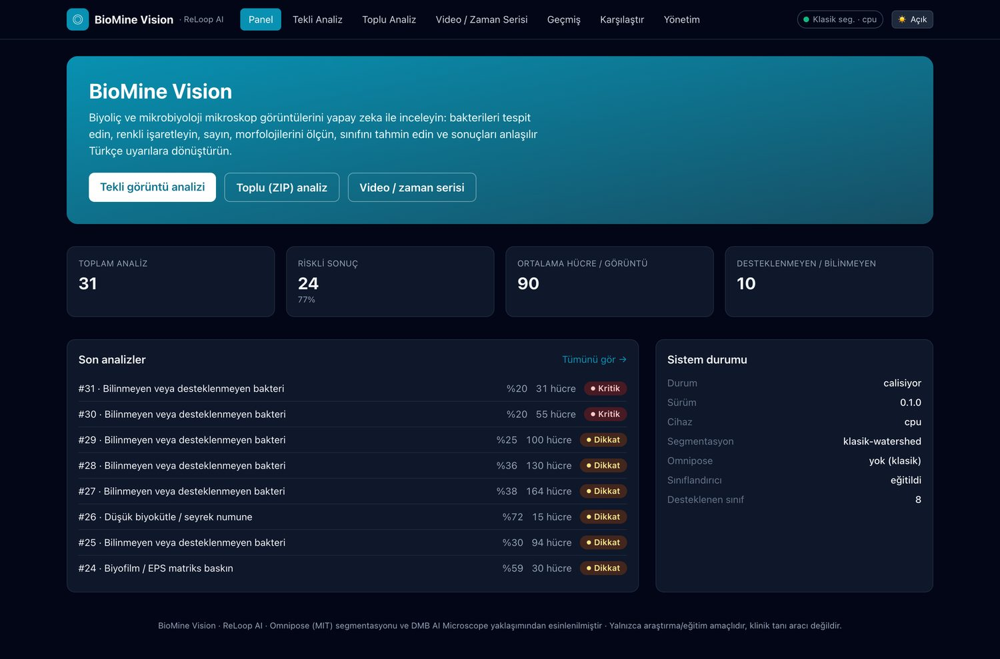

---

## Model ve veri seti bilgileri

### Segmentasyon modeli — Omnipose
- Yerleşik **`bact_phase_omni`** (faz-kontrast bakteri) modeli varsayılan; ilk
  kullanımda otomatik iner. `OMNIPOSE_MODEL=bact_fluor_omni` ile floresan moduna geçilebilir.
- Omnipose kurulu değilse sistem **Otsu + mesafe dönüşümü + watershed** yedeğine düşer
  ve hangi yöntemin kullanıldığını her sonuçta raporlar (`segmentasyon_yontemi`).

### Sınıflandırma modeli — BioMine Vision DEMO
- **Mimari:** `torchvision.efficientnet_v2_s` omurgası + numune sınıflarına göre
  yeniden boyutlandırılmış kafa (DMB AI Microscope'un EfficientNetV2 + Grad-CAM
  **yaklaşımından** esinlenildi; kod yeniden yazıldı).
- **Eğitim verisi:** Gerçek etiketli biyoliç veri kümeleri paylaşım kısıtlı olduğu
  için `scripts/ornek_veri_uret.py` her sınıf için **sentetik faz-kontrast benzeri**
  görüntüler üretir (çubuk yoğun/seyrek, kok küme/zincir, filament, biyofilm, karışık
  kültür, düşük biyokütle). `scripts/model_egit.py` bu veriyle modeli eğitir.
- **Varsayılan eğitim:** omurga dondurulmuş, yalnızca sınıflandırma kafası, 6 epok,
  224 px — CPU'da ~5 dakika, sentetik doğrulama doğruluğu **~%95**.
  Tam eğitim: `python scripts/model_egit.py --epok 12` (dondurmadan).
- **Desteklenen 8 sınıf** (`app/ml/siniflar.py`): morfoloji temelli, biyoliç
  bağlamında anlamlı genel kategoriler. **Bu listede olmayan bakteriler için sistem
  uydurma tahmin yapmaz.** Güven, `ESIK_guven_dusuk` (varsayılan %55) altındaysa
  sonuç **"Bilinmeyen veya desteklenmeyen bakteri"** olur.
- **Üretim için:** `SINIFLAR` listesini kendi etiketlerinizle güncelleyip
  `model_egit.py`'yi kendi veri kümenizle (`ornek_veri/<sinif>/*.png` yapısında)
  yeniden çalıştırın. Ağırlık dosyasını dışarıdan indirmek için
  `SINIFLANDIRICI_URL` (https + opsiyonel `SINIFLANDIRICI_SHA256`) kullanılabilir.

### Grad-CAM
`app/core/grad_cam.py` — son evrişim bloğuna ileri/geri kanca takıp sınıf-ayrımlı
ısı haritası üretir; JET renk haritasıyla görüntüye bindirilir.

### Veritabanı
`Numune`, `Analiz`, `Ayar` tabloları. SQLite (varsayılan) veya PostgreSQL. Analiz
çıktısı görüntüleri `veri/ciktilar/` altına yazılır ve `/veri/...` yolundan sunulur.

---

## Kural motoru ve uyarılar

| Kod | Koşul (eşik anahtarı) | Seviye | Mesaj |
|---|---|---|---|
| `goruntu_kalitesi` | Laplacian < `bulaniklik_esik` **veya** parlaklık < `karanlik_esik` | 🔴 kritik | "Görüntüyü yeniden yükleyin" |
| `yetersiz_numune` | hücre sayısı < `min_hucre_sayisi` | 🔴 kritik | "Numune veya görüntü kalitesi yetersiz" |
| `dusuk_guven` | güven < `guven_uyari` | 🟡 dikkat | "Sonuç güvenilir değil" |
| `desteklenmeyen_sinif` | güven < `guven_dusuk` veya model eğitilmedi | 🟡 dikkat | "Bilinmeyen veya desteklenmeyen bakteri" |
| `asiri_yogunluk` | kaplama > `asiri_yogunluk_kaplama` veya yoğunluk > `asiri_yogunluk_mp` | 🟡 dikkat | "Aşırı hücre yoğunluğu analizi etkileyebilir" |
| `karisik_kultur` | baskın morfoloji oranı < `baskin_morfoloji_orani` | 🟡 dikkat | "Karışık kültür veya kontaminasyon ihtimali" |
| `aktivite_kaybi` | ardışık karede düşüş > `aktivite_kaybi_dusus_orani` | 🔴 kritik | "Bakteriyel aktivite kaybı olabilir" |
| `seri_aktivite_kaybi` | seri başı→sonu düşüş > eşik | 🔴 kritik | seri geneli aktivite kaybı |

**Risk seviyesi:** `kritik` uyarı sayısı `kritik_uyari_sayisi` eşiğine ulaşırsa
**Kritik**; en az bir kritik veya ≥2 dikkat varsa **Dikkat**; aksi hâlde **Normal**.
Tüm eşikler **Yönetim** ekranından (`PUT /api/ayarlar/{anahtar}`) değiştirilebilir
ve `ayar` tablosunda kalıcıdır.

---

## API uç noktaları

| Yöntem | Yol | Açıklama |
|---|---|---|
| `GET` | `/api/saglik` | sürüm, cihaz, Omnipose durumu, segmentasyon yöntemi |
| `POST` | `/api/analiz/gorsel` | tek görüntü (multipart: `dosya`, `gradcam`, `gurultu_azaltma`, …) |
| `POST` | `/api/analiz/toplu` | ZIP içindeki tüm görüntüler |
| `POST` | `/api/analiz/video` | MP4/AVI, `kare_araligi_sn`, zaman serisi + seri uyarıları |
| `POST` | `/api/analiz/ornek?ad=<sinif>` | paketteki örnek görüntüyü analiz et |
| `GET` | `/api/gecmis` | analiz geçmişi (`limit`, `offset`, `sadece_riskli`) |
| `GET` `DELETE` | `/api/gecmis/{id}` | analiz getir / sil |
| `GET` | `/api/gecmis/numune/{id}` | bir numunenin tüm kareleri |
| `POST` | `/api/karsilastir` | iki analizi karşılaştır (`analiz_id_1`, `analiz_id_2`) |
| `GET` `PUT` | `/api/ayarlar` , `/api/ayarlar/{anahtar}` | eşikleri listele / güncelle |
| `GET` | `/api/ayarlar/siniflar` | modelin desteklediği sınıflar |
| `POST` | `/api/disari-aktar` | `{analiz_idleri, bicim: pdf\|csv\|json}` |

Etkileşimli dokümantasyon: `http://localhost:8000/docs`

---

## Testler

```bash
cd backend && source .venv/bin/activate
python -m pytest -q          # 28 test: ön işleme, segmentasyon, morfoloji,
                             # kural motoru, sınıflandırıcı, Grad-CAM, API akışları
```

GitHub Actions (`.github/workflows/ci.yml`) her push'ta backend testlerini ve
frontend derlemesini çalıştırır.

**Bu depoda doğrulanan uçtan uca akışlar:**
`scripts/kurulum.sh` · `scripts/model_egit.py` (DEMO model, ~%95 doğrulama) ·
`pytest` (28/28) · `scripts/demo.py` (tekli + ZIP + video + PDF/CSV/JSON) ·
arayüzden tekli/toplu/video analizi, geçmiş, karşılaştırma, yönetim ve rapor
indirme (ekran görüntüleri gerçek çalışmadan alınmıştır).

---

## Bilinen sınırlamalar

- **DEMO sınıflandırıcı sentetik veriyle eğitilir.** Gerçek biyoliç numunelerinde
  kullanmadan önce kendi etiketli veri kümenizle yeniden eğitin. Model eğitilmemişse
  arayüz bunu açıkça belirtir ve tüm tahminler "desteklenmeyen" işaretlenir.
- **Omnipose kurulu değilse** morfoloji ölçümleri klasik watershed'e dayanır; yoğun,
  birbirine değen çubuk hücrelerde bu yöntem parçalanmaya (over-segmentation)
  eğilimlidir. Doğru morfoloji için Omnipose kurulması önerilir (`KUR_OMNIPOSE=1`).
- Grad-CAM kalitesi modelin eğitim kalitesine bağlıdır.
- Çok büyük TIFF'ler bellek için `1536 px` uzun kenara ölçeklenir.
- Video analizi kareleri eşit aralıklarla örnekler; sahne değişimi tespiti yoktur.
- Kimlik doğrulama / çok kullanıcılı yetkilendirme kapsam dışıdır (tek ekip aracı).
- Sistem **IoT, sensör, donanım kontrolü, CRISPR / genom düzenleme ve dijital ikiz**
  özellikleri **içermez** (tasarım gereği kapsam dışı).

---

## Lisanslar

- **BioMine Vision:** [MIT](LICENSE)
- **Omnipose:** MIT — bildirim korunur: [`NOTICE`](NOTICE),
  [`docs/lisanslar/OMNIPOSE-LICENSE.txt`](docs/lisanslar/OMNIPOSE-LICENSE.txt)
- **Cellpose** (Omnipose'un dayandığı çalışma): BSD-3-Clause —
  [`docs/lisanslar/CELLPOSE-LICENSE.txt`](docs/lisanslar/CELLPOSE-LICENSE.txt)
- **DMB AI Microscope:** deposunda açık lisans yok; **kodu kopyalanmadı**, yalnızca
  mimari yaklaşımı referans alındı ve kaynak gösterildi.
- Diğer bağımlılıkların lisansları [`NOTICE`](NOTICE) dosyasında listelenmiştir.

---

## Gelecek geliştirmeler

- [ ] Gerçek etiketli biyoliç veri kümesiyle eğitilmiş sınıflandırıcı ve genişletilmiş sınıf listesi
- [ ] Omnipose'un `bact_fluor_omni` + kendi eğitilmiş Omnipose modeli seçenekleri
- [ ] Hücre takibi (tracking) ile bölünme/ölüm oranı ve büyüme eğrisi kestirimi
- [ ] Ölçek kalibrasyonu (µm/piksel) ile ölçümlerin mikrometre cinsinden verilmesi
- [ ] Toplu işlerde arka plan kuyruğu (Celery/RQ) ve ilerleme yüzdesi
- [ ] Kullanıcı hesapları, proje/numune bazlı erişim
- [ ] Raporlara laboratuvar başlığı / logo ekleme, çoklu dil (EN)
- [ ] ONNX/TensorRT ile hızlandırılmış çıkarım
- [ ] Aktif öğrenme: düşük güvenli örnekleri etiketleme kuyruğuna alma

---

<div align="center">
<sub>BioMine Vision · ReLoop AI · 2026 — MIT Lisansı</sub>
</div>
